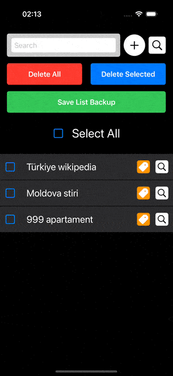

# Ios-Fav-Browser
 Your fav keyword search.

## Descriere
Această aplicație iOS este un manager eficient de cuvinte cheie și linkuri, proiectat pentru a ajuta utilizatorii să-și organizeze și să-și gestioneze listele de căutare și referințe.

### Caracteristici principale:
- **Gestionare ușoară a listei**: Adăugați, editați și ștergeți cuvinte cheie cu ușurință
- **Căutare Google integrată**: Căutați direct termenii salvați în Google
- **Backup și export**: Exportați lista dvs. în format JSON pentru backup
- **Etichetare conținut**: Adăugați descrieri și note pentru fiecare element
- **Selecție multiplă**: Selectați și gestionați mai multe elemente simultan
- **Interfață intuitivă**: Design modern și ușor de utilizat în mod întunecat
- **Notificări**: Primiți confirmări pentru acțiunile importante

### Funcționalități tehnice:
- Dezvoltat în SwiftUI
- Suport pentru persistența datelor
- Gestionare eficientă a memoriei
- Compatibil cu modul întunecat
- Optimizat pentru toate dispozitivele iOS

## Cerințe sistem
- iOS 15.0 sau mai recent
- Xcode 13.0 sau mai recent pentru dezvoltare

## Instalare
1. Clonați repository-ul
2. Deschideți proiectul în Xcode
3. Compilați și rulați aplicația pe simulator sau dispozitiv fizic
